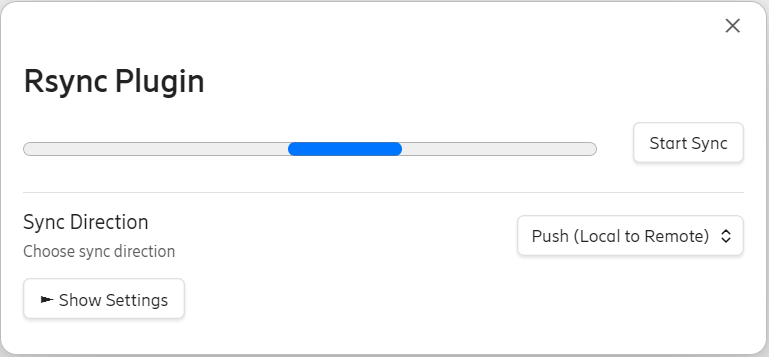
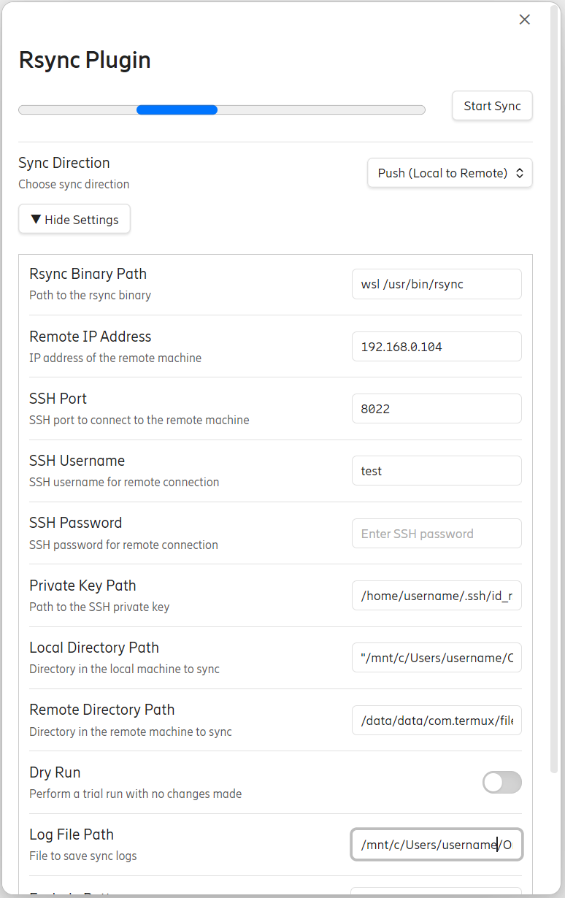

Rsync Plugin for Obsidian

The Rsync Plugin for Obsidian allows you to sync directories between your local machine and a remote server using rsync. This plugin provides a user-friendly interface for managing rsync operations directly within Obsidian, allowing you to automate syncing, perform manual syncs with a progress bar, and configure various rsync options like exclusions and logging.

Features

Push/Pull Sync: Sync data from local to remote (push) or from remote to local (pull).

Dry Run: Run rsync in dry-run mode to preview changes without actually making them.

Periodic Syncing: Schedule automatic sync intervals.

Custom Exclusions: Exclude specific files or directories from syncing.

Logging: Save logs of the sync operation to a file for reference.

SSH Support: Connect to remote servers using SSH, with support for SSH password or private key authentication.

How to Install

Download or clone the plugin into the appropriate plugin folder in your Obsidian vault.

Open Obsidian, go to the Settings > Community Plugins > Installed Plugins.

Enable the Rsync Plugin.

How to Use the Plugin

Manual Sync

Click on the sync icon in the ribbon (located in the top-right of the Obsidian interface).

A modal will open with sync settings.

Choose the sync direction (push or pull).

Click Start Sync to initiate the sync process. A progress bar will show the sync progress in real-time.

Schedule Automatic Sync

Go to Settings > Rsync Plugin Settings.

Set the Schedule Interval in minutes to automatically trigger syncing at a regular interval.

Configure the rest of the settings like rsync binary path, SSH credentials, local/remote directories, etc.

Sync Options

Rsync Binary Path: Provide the path to the rsync executable.

Remote Server Details: Set your remote server's IP, SSH port, username, and either password or private key path.

Directories to Sync: Define the local and remote directories to be synced.

Exclusions: Add file patterns to exclude from syncing (e.g., *.log to exclude all log files).

Logging: Set the path for a log file to record sync operations.

Sync Direction

Push: Transfer files from your local machine to the remote server.

Pull: Download files from the remote server to your local machine.

How to Use Rsync on Windows Using WSL (Windows Subsystem for Linux)

On Windows, rsync is not natively available, but you can easily use it through WSL (Windows Subsystem for Linux). Here's how to set it up:

Steps:

Install WSL:

If you haven't already, install WSL by following the official Microsoft guide: Install WSL.

Once installed, open the WSL terminal (you can search for "WSL" or your chosen Linux distro like Ubuntu).

Install rsync in WSL:

Open your WSL terminal and run: sudo apt update sudo apt install rsync 

This will install rsync within the WSL environment.

Find the Path to rsync in WSL:

You can find the location of rsync by running: which rsync 

The typical path is something like /usr/bin/rsync.

Configure the Plugin:

In Obsidian, set the Rsync Binary Path in the plugin settings to the path of rsync in WSL. For example: C:\Users\<YourUserName>\AppData\Local\Packages\CanonicalGroupLimited.UbuntuonWindows_79rhkp1fndgsc\LocalState\rootfs\usr\bin\rsync Alternatively, you can use the wsl command to invoke rsync in WSL directly, like this: wsl rsync 

Use the Plugin:

Once configured, you can use the Rsync Plugin in Obsidian as you would on a Unix-based system, syncing files to and from remote servers.

Configuration Options

Rsync Binary Path: Path to the rsync executable (use WSL’s path if on Windows).

Remote IP: The IP address of the remote server.

SSH Port: The SSH port for connecting to the remote server.

SSH Username: The SSH username for the remote server.

SSH Password: (Optional) SSH password for authentication.

Private Key Path: (Optional) Path to your SSH private key.

Local Directory Path: Path to the local directory you want to sync.

Remote Directory Path: Path to the remote directory to sync.

Sync Direction: Choose between push (local to remote) or pull (remote to local).

Dry Run: Enable to simulate the sync without actually making changes.

Log File Path: Path to save logs of the sync operation.

Exclude Patterns: Patterns of files or directories to exclude from syncing.

Schedule Interval: Interval (in minutes) for periodic syncs.

Troubleshooting

Ensure rsync is installed and accessible on your system (via WSL for Windows users).

Verify your SSH credentials (username, password, or private key) for remote server access.

Check the paths for both local and remote directories to ensure they're correctly configured.

License

This plugin is open-source and free to use. Contributions are welcome!

